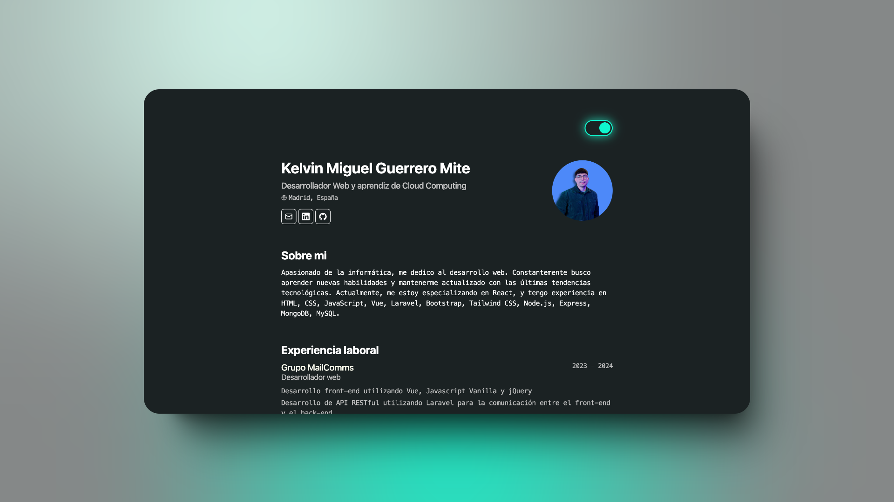

<div align="center">
<p>
Basado en el diseño de <a href="https://github.com/BartoszJarocki/cv">Bartosz Jarocki</a>
</p>

</div>

<div align="center">
    <a href="#🚀-empezar">
        Empezar
    </a>
    <span>&nbsp;✦&nbsp;</span>
    <a href="#🧞-comandos">
        Comandos
    </a>
    <span>&nbsp;✦&nbsp;</span>
    <a href="#🔑-licencia">
        Licencia
    </a>
    <span>&nbsp;✦&nbsp;</span>
    <a href="https://kelvinguerrero.dev">
        Personal
    </a>
   
</div>

<p></p>

</img>

## 🛠️ Stack

- [**Astro**](https://astro.build/) - El framework web de la nueva época.
- [**Typescript**](https://www.typescriptlang.org/) - JavaScript con sintaxis de tipado.
- [**Ninja Keys**](https://github.com/ssleptsov/ninja-keys) - Menu desplegable con atajos de teclado hecho en puro Javascript.


## 🚀 Empezar

### 1. Usa este [repo](https://github.com/midudev/minimalist-portfolio-json) como _template_ de un proyecto de Astro


- Yo uso [pnpm](https://pnpm.io/installation) como gestor de dependencias y empaquetador.

```bash
# Activa pnpm en MacOS, WSL & Linux:
corepack enable
corepack prepare pnpm@latest --activate

# Inicializa el proyecto
pnpm create astro@latest -- --template midudev/minimalist-portfolio-json
```

### 2. Añade tu contenido:
Edita el archivo `cv.json` para crear tu propio Portafolio/CV imprimible.
### 3. Lanza el servidor de desarrollo:

```bash
# Disfruta del resultado
pnpm dev
```


1. Abre [**http://localhost:4321**](http://localhost:4321/) en tu navegador para ver el resultado 🚀


## 🧞 Comandos

|     | Comando          | Acción                                        |
| :-- | :--------------- | :-------------------------------------------- |
| ⚙️  | `dev` o `start` | Lanza un servidor de desarrollo local en  `localhost:4321`.  |
| ⚙️  | `build`          | Comprueba posibles errores y hace un empaquetado de producción en `./dist/`.      |
| ⚙️  | `preview`        | Vista previa en local `localhost:4321` |
